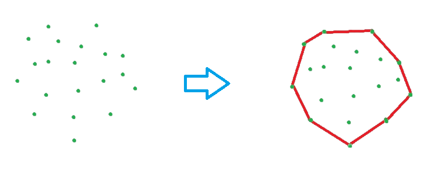

## Introduction

Jarvis Algorithm is **Computational Geometry** Algorithm known for finding the `convex hull` of the given set of points.
This Algorithm is also known by several other names, including the _`Jarvis March Algorithm`_(In the two-dimensional case) and the _`Gift Wrap Algorithm`_.

Can be expanded to multiple dimensions. In 3 dimensions:

- Pick 3 points that form a face and act as a leftmost plane.
- Pick half planes in a similar fashion to picking leftmost lines.


## Explanation

**Convex Hull** is a line that completely surrounds a set of points in a plane while comprising no concavities. More explicitly, it is the smallest  polygon that surrounds a set of points such that each point in the set lies within or on the perimeter of the polygon.

Let's have example:



In the Jarvis Algorithm, we begin at the leftmost point of the given data set and rotate anti-clockwise to keep the points in the convex hull. The next point is chosen from a current point by checking the orientations of those points from the current point. The point is chosen when the angle is the greatest. Stop the algorithm once all points have been completed and the next point is the start point.

The operation of Jarvis is similar to the operation of selection sort. In selection sort, we find the smallest number in each step and add it to the sorted list. In Jarvis, we find the leftmost point and add it to the convex hull vertices with each step.

## Algorithm

**step 1.** Set **a** to the `leftmost point`.

**step 2.** The following point **b** is the point at which the triplet `(a, b, c)` rotates anticlockwise for any other point **c**.

**step 3.** Set **b** to the next point and then traverse through all points. If **m** is more anticlockwise, i.e., orientation `(a, m, b)` is anticlockwise, we update **b** as **m**. Our final **b** value will be the most anticlockwise point.

**step 4.** Now **b** becomes **a** and we repeat the step(2) and step(3) again.

**step 5.** Repeat above steps until we reach the point where we started.


## Code

import Tabs from '@theme/Tabs';
import TabItem from '@theme/TabItem';

<Tabs
defaultValue="cpp"
values={[
{ label: 'C++', value: 'cpp', },
{ label: 'Python', value: 'py', },
]
}>

<TabItem value="cpp">

```cpp

#include<iostream>
#include<set>
#include<vector>
using namespace std;

//define points
struct point {
    int x, y;

    bool operator==(point p2) {
        if (x == p2.x && y == p2.y)
            return 1;
        return 0;
    }
    //function used to sort in set
    bool operator<(const point& p2)const {
        return true;
    }
};
//finds the place of c from ab vector
int crossProduct(point a, point b, point c) {
    int y1 = a.y - b.y;
    int y2 = a.y - c.y;
    int x1 = a.x - b.x;
    int x2 = a.x - c.x;
    return y2 * x1 - y1 * x2;          //if result < 0, c in the left, > 0, c in the right, = 0, a,b,c are collinear
}

int distance(point a, point b, point c) {
    int y1 = a.y - b.y;
    int y2 = a.y - c.y;
    int x1 = a.x - b.x;
    int x2 = a.x - c.x;

    int item1 = (y1 * y1 + x1 * x1);
    int item2 = (y2 * y2 + x2 * x2);

    if (item1 == item2)
        return 0;             //when b and c are in same distance from a
    else if (item1 < item2)
        return -1;            //when b is closer to a
    return 1;                 //when c is closer to a
}

set<point>findConvexHull(point points[], int n) {
    point start = points[0];
    for (int i = 1; i < n; i++) {              //find the left most point for starting
        if (points[i].x < start.x)
            start = points[i];
    }

    point current = start;
    set<point> result;                 //avoid entry of duplicate points
    result.insert(start);
    vector<point>* collinearPoints = new vector<point>;

    while (true) {
        point nextTarget = points[0];

        for (int i = 1; i < n; i++) {
            if (points[i] == current)       //when selected point is current point, ignore rest part
                continue;
            int val = crossProduct(current, nextTarget, points[i]);

            if (val > 0) {            //when ith point is on the left side
                nextTarget = points[i];
                collinearPoints = new vector<point>;      //reset collinear points

            }
            else if (val == 0) {          //if three points are collinear
                if (distance(current, nextTarget, points[i]) < 0) {
                    collinearPoints->push_back(nextTarget);
                    nextTarget = points[i];
                }
                else {
                    collinearPoints->push_back(points[i]);
                }
            }
        }
        vector<point>::iterator it;

        for (it = collinearPoints->begin(); it != collinearPoints->end(); it++) {

            result.insert(*it);
        }

        if (nextTarget == start)
            break;
        result.insert(nextTarget);
        current = nextTarget;
    }
    return result;
}

int main() {
    point points[] = { {1,2},{7,4},{2,6},{5,8}, {1,10},{0,0},{-2,2},{-4,-4},{-6,0},{-8,8}, {-1,5} };
    int n = 11;
    set<point> result;
    result = findConvexHull(points, n);
    cout << "Boundary points of convex hull are: " << endl;
    set<point>::iterator it;

    for (it = result.begin(); it != result.end(); it++)
        cout << "(" << it->x << ", " << it->y << ") ";
}
```

</TabItem>
<TabItem value="py">

```python

# point class with x, y as point
class Point:
    def __init__(self, x, y):
        self.x = x
        self.y = y

def Left_index(points):
    minn = 0
    for i in range(1,len(points)):
        if points[i].x < points[minn].x:
            minn = i
        elif points[i].x == points[minn].x:
            if points[i].y > points[minn].y:
                minn = i
    return minn

def orientation(p, q, r):
    val = (q.y - p.y) * (r.x - q.x) - \
          (q.x - p.x) * (r.y - q.y)

    if val == 0:
        return 0
    elif val > 0:
        return 1
    else:
        return 2

def convexHull(points, n):

    # There must be at least 3 points
    if n < 3:
        return

    # Find the leftmost point
    l = Left_index(points)

    hull = []
    p = l
    q = 0
    while(True):

        # Add current point to result
        hull.append(p)
        q = (p + 1) % n

        for i in range(n):

            # If i is more counterclockwise
            # than current q, then update q
            if(orientation(points[p],
                           points[i], points[q]) == 2):
                q = i

        p = q

        # While we don't come to first point
        if(p == l):
            break

    # Print Result
    for each in hull:
        print(points[each].x, points[each].y)

# Driver Code
points = []
points.append(Point(1, 2))
points.append(Point(7, 4))
points.append(Point(2, 6))
points.append(Point(5, 8))
points.append(Point(1, 10))
points.append(Point(0, 0))
points.append(Point(-2, 2))
points.append(Point(-4, -4))
points.append(Point(-6, 0))
points.append(Point(-8, 8))
points.append(Point(-1, 5))

convexHull(points, len(points))
```

</TabItem>
</Tabs>

## Sample Input and Output

### Input:

The input is set of points in 2D space .

```
 (1,2), (7,4), (2,6), (5,8), (1,10), (0,0), (-2,2), (-4,-4), (-6,0), (-8,8), (-1,5)
```

### Output:

The output is points of the convex hull.

```
Boundary points of convex hull are:
(-6, 0) (-4, -4) (7, 4) (5, 8) (1, 10) (-8, 8)
```


## Complexity Analysis

```
1. Time complexity -  O(nh)
where n is the number of points and h is the number of points on the convex hull

2. Space complexity - O(n)
```
