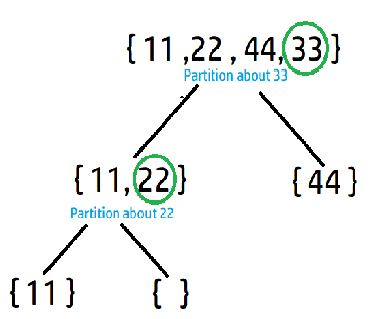
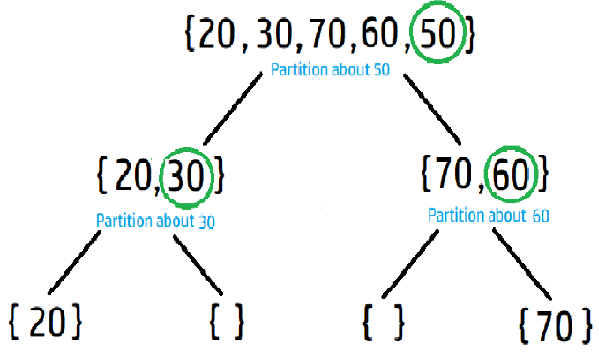

# Introduction

Quick Sort is a sorting algorithm which follows Divide and Conquer. In this algorithm it picks an element as a pivot
and arrange the array according to this pivot element.The condition to arrange the array according to pivot element
is that all the elements which are smaller than or equal to pivot must lies on the left side of pivot.
And all the elements which are greater than pivot must lie on the right side of the pivot. 
This can be done in-place, requiring small additional amounts of memory to perform the sorting.  

# Algorithm

In Quick Sort, we follow the following algorithm:

* first we have to pick a pivot element.

* Then partition the array according to pivot element(smaller or equal elements than pivot must lies on left side and greater on right).

* Then apply same steps 1 & 2 on the left part of pivot and right part of pivot recursively.

* We do step 3 until we left with single element.

# Explanation for Quick Sort

### Example 1



```

 Array arr[4]:        
 | 11 | 22 | 44 | 33 |                               
 Pivot element=33  
 After Partition :
 | 11 | 22  || 33 || 44 |                                             
 left part= | 11 | 22 | 
 right part= | 44 |                                      
 Pivot element= | 22 |
 left part= | 11 |
 | 11 || 22 || 33 | 44 |
  Sorted!! 

```
### Example 2


```
 Array arr[5]:        
 | 20 | 30 | 70 | 60 | 50 |
 Pivot element=50  
 After Partition :
 | 20 | 30 || 50 || 70 | 60 |
 Pivot from left part= 30
 After partition:
 | 20 || 30 || 50 | 70 | 60 |
Pivot from right part= 60
 After partition:
 | 20 | 30 | 50 || 60 || 70 |
Sorted!!
```

# Code

import Tabs from '@theme/Tabs';
import TabItem from '@theme/TabItem';

<Tabs
  defaultValue="cpp"
  values={[
    { label: 'C++', value: 'cpp', },
    { label: 'Python', value: 'py', },
  ]
}>
<TabItem value="cpp">

```cpp
#include<iostream>        //Header file 
using namespace std;      //For cin and cout

//Implement partitionPivot function
int partitionPivot( int a[], int start, int end ){

    int i= start-1;
    int j= start;
    int pivot= a[end];

    //Traverse the array - whenever an element smaller than pivot occurs, swap it with (i+1)th element 
    for(j= start; j<= end-1; j++){
        
        if(a[j] <= pivot){
            i++;
            swap(a[i],a[j]);
        }
    }

    //Place the pivot element at i+1 (between smaller and larger elements)
    swap(a[i+1],a[end]);

    //Return position of pivot
    return i+1;
}

//Implement Quick Sort function
void quickSort( int a[], int start, int end ){

    //base case
    //If start (index) crosses end (index), there are no elements to sort further, thus return
    if( start >= end ){
        return;
    }

    //Taking end element as pivot, place the pivot element in its right position such that
    //elements left to the pivot are smaller than pivot and elements right to the pivot are greater than pivot
    //Return pivot's position (index)
    int p= partitionPivot( a, start, end );

    //Recursively sort left and right part of the pivot element
    //Left part of the pivot
    quickSort( a, start, p-1 );
    //Right part of the pivot
    quickSort( a, p+1, end);

    return;
}

int main(){

    int n;
    cout<<"Enter the number of elements: ";
    cin>>n;

    int a[n];
    cout<<endl<<"Enter the elements of the array: ";
    
    for(int i= 0; i<n; i++){        //For loop to input n elements into the array
        cin>>a[i];
    }

    //Call the quick sort function on the array - quickSort( array_name, start, end);
    quickSort( a, 0, n-1 );

    //Print the sorted array
    cout<<endl<<"The sorted array is: ";
    for(int i= 0; i< n; i++){
        cout<<a[i]<<" ";
    }


    return 0;
}

```
</TabItem>

<TabItem value="py">

```python   
# Program to implement QuickSort Algorithm in Python


def partition(arr, low, high):
    '''
    The value of i is initialized to (low-1) since initially first element
    is swapped by itself
    Reason: no greater element has been encountered apart from itself
    '''
    pivotElement = arr[high]
    i = (low - 1)

    for j in range(low, high):
        if arr[j] < pivotElement:
            i += 1
            # swap elements arr[i] and arr[j]
            arr[i], arr[j] = arr[j], arr[i]

    # swap pivot element with element at index=(i + 1) since loop ended,
    # to obtain LHS of pivot
    arr[i + 1], arr[high] = arr[high], arr[i + 1]

    return(i + 1)

'''
This is the calling function that implements QuickSort algorithm, where:
arr = input array given by user
low = starting index
high = ending index
'''


def quickSort(arr, low, high):
    if low < high:

        # pi is partitioning index, arr[p] is now at right place
        pi = partition(arr, low, high)

        # Separately sort elements before partition and after partition
        quickSort(arr, low, pi-1)
        quickSort(arr, pi+1, high)

# main function
if __name__ == "__main__":
    arr = []
    n = int(input("Enter the number of elements: "))
    print('Enter the elements of the array: ')
    for i in range(n):
      arr.append(int(input()))
    quickSort(arr, 0, n-1)
    print('The sorted array is: ')
    for i in range(n):
        print(arr[i], end=" ")
    print()
    
```
</TabItem>
</Tabs>

# Sample Input and Output


### Input :

```
Enter the number of elements: 5

Enter the elements of the array: 22 11 44 55 33
```
### Output :

```
The sorted array is: 11 22 33 44 55
```

# Time & Space Complexity
 
Quick sort algorithm partition the array about pivot . So the worst case is if we pick the pivot element greatest or smallest .
Because then we have to call partititon function n times on n elements so time complexity becomes: O(n^2).
And the best case is when we pick the pivot  as middle element.So we have to call partititon function logn times
on n elements. So time complexity becomes: O(nlogn). And in average case also time complexity:O(nlogn).

Best or average case Time Complexity: O(nlogn)

Worst case Time Complexity: O(n^2)

Space Complexity: O(logn)

### Credits
1. [Aditya Saxena](https://github.com/asaxena012) for the [C++ implementation](https://github.com/TesseractCoding/NeoAlgo/blob/master/C-Plus-Plus/sort/Quick_Sort.cpp)

2. [Ricardo Prins](https://github.com/ricardoprins) for the [Python implementation](https://github.com/TesseractCoding/NeoAlgo/blob/master/Python/sort/QuickSort.py)